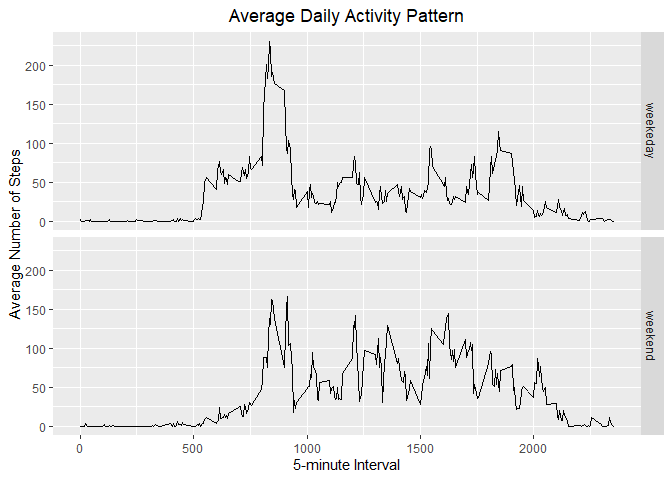

## Loading and preprocessing the data
1. Load the data into R

```r
activityData <- read.csv(file="activity.csv", header=TRUE)
```


## What is mean total number of steps taken per day?

```r
totalSteps <- aggregate(steps ~ date, activityData, FUN=sum)
hist(totalSteps$steps,
     main = "Total Steps per Day",
     xlab = "Number of Steps")
```

<!-- -->


```r
meanSteps <- mean(totalSteps$steps, na.rm = TRUE)
medSteps <- median(totalSteps$steps, na.rm = TRUE)
```

## What is the average daily activity pattern?


```r
library(ggplot2)
meanStepsByInt <- aggregate(steps ~ interval, activityData, mean)
ggplot(data = meanStepsByInt, aes(x = interval, y = steps)) +
  geom_line() +
  ggtitle("Average Daily Activity Pattern") +
  xlab("5-minute Interval") +
  ylab("Average Number of Steps") +
  theme(plot.title = element_text(hjust = 0.5))
```

<!-- -->

```r
maxInt <- meanStepsByInt[which.max(meanStepsByInt$steps),]
```

## Imputing missing values

```r
missingVals <- activityData[!complete.cases(activityData$steps),]
nrow(missingVals)
```

```
## [1] 2304
```

```r
imp_activityData <- transform(activityData,
                              steps = ifelse(is.na(activityData$steps),
                                             meanStepsByInt$steps[match(activityData$interval, 
                                                                        meanStepsByInt$interval)],
                                             activityData$steps))


impStepsByInt <- aggregate(steps ~ date, imp_activityData, FUN=sum)
hist(impStepsByInt$steps,
     main = "Imputed Number of Steps Per Day",
     xlab = "Number of Steps")
```

<!-- -->

## Are there differences in activity patterns between weekdays and weekends?  

```r
DayType <- function(date) {
  day <- weekdays(date)
  if (day %in% c('Monday', 'Tuesday', 'Wednesday', 'Thursday', 'Friday'))
      return ("weekeday")
  else if (day %in% c('Saturday', 'Sunday'))
      return ("weekend")
  else
      stop ("Invalid Date Format.")
}
imp_activityData$date <- as.Date(imp_activityData$date)
imp_activityData$day <- sapply(imp_activityData$date, FUN = DayType)

meanStepsByDay <- aggregate(steps ~ interval + day, imp_activityData, mean)
ggplot(data = meanStepsByDay, aes(x = interval, y = steps)) + 
  geom_line() +
  facet_grid(day ~ .) +
  ggtitle("Average Daily Activity Pattern") +
  xlab("5-minute Interval") +
  ylab("Average Number of Steps") +
  theme(plot.title = element_text(hjust = 0.5))
```

<!-- -->
